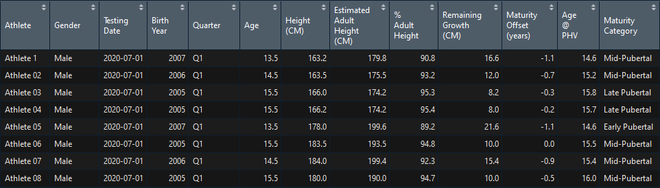
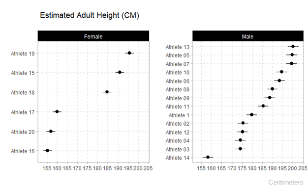
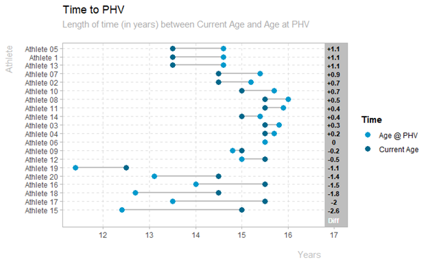
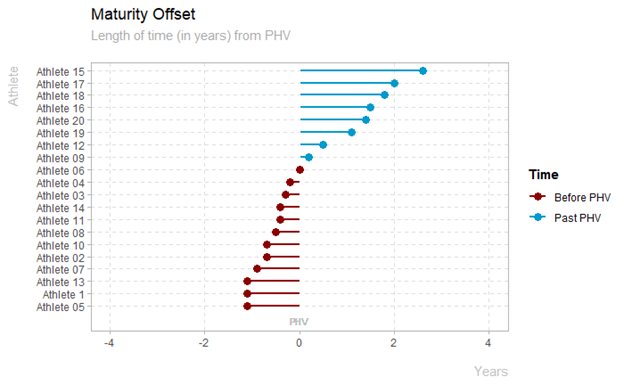
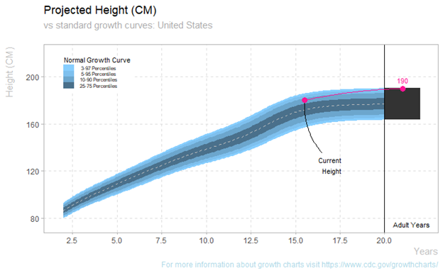
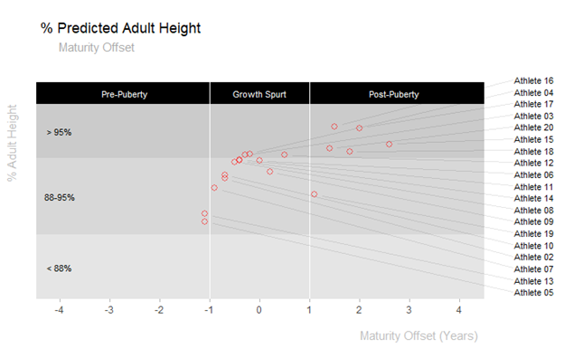

# {matuR}
### Athlete Maturation and Biobanding


## Intro
Maturity profiling in young athletes is paramount for talent identification. The concept of [biobanding,](https://www.collinsdictionary.com/es/diccionario/ingles/biobanding) or grouping of athletes based on their biological development as opposed to their chronological age, has also been widely researched to enable comparison of physical attributes across young athletes as well as better adjustment of the training and competition demands athletes are exposed to. 
  
The goal of this repository is to showcase **{matuR}**, a package that provides a simple framework for professionals working with young athletes to calculate and visualize common maturation metrics using not invasive methods. The two methods implemented are:

**Prediction of age at Peak Height Velocity (PHV):** This method is based on research from Mirlwald et al and uses the following parameters:

* gender  
* date of birth  
* date of measurement  
* height (cms)  
* sitting height (cms)  
* weight (kgs)  
  
**Predicted Adult Height (PAH):** This is based on the Khamis-Roche method and uses the following parameters:  

* age
* gender
* height (cms)  
* weight (kgs)  
* mother height (cms)  
* father height (cms)  
  
For further details about these two methods, their protocols and calculations see the reference section at the bottom of this page.  


## Installation

Install from CRAN**  
```
{matuR} has not been submitted to CRAN yet. Please use the development version.
```
  
Install the development version from GitHub**  
```
install.packages("devtools")
devtools::install_github("josedv82/matuR")
```

## Data

#### User Data

Use this template for data collection. Ensure that all fields have information. Some fields require a double measurement to calculate the average.

**{matuR}** runs both (age @ PHV and Khamis-Roche) methods together on the same dataset.

[Data Template](https://github.com/josedv82/matuR/blob/master/man/images/template.xlsx)

#### Demo Data

**{matuR}** comes with a sample dataset for users to familiarize with the package. 

```
library(matuR)

data_sample
```

## Usage

#### Data Frames:

The two main functions within the package are *`maturation_cm()`* and *`maturation_in()`*. Both functions perform the same calculations and return the same data. Users can choose one or the other one depending on which units they wish to explore the results. The function takes the raw data from the template and performs the Khamis-Roche and Mirwarld calculations returning a dataframe that users can manipulate for further analysis.

```
library(matuR)

maturation_cm(data_sample)
```



#### Plots

**{matuR}** provides a few plotting options:

Predicted Adult Height Plot (note the two options depending on cms or inches)

```
plot_predicted_height_cm(data_sample)
plot_predicted_height_in(data_sample)
```


Time to PHV Dumbell Plot

```
plot_time_phv(data_sample)
```


Maturity Offset Plot

```
plot_maturity_offset(data_sample)
```


Plot the current and predicted height for one athlete against normal growth curves. The same function is available for females.
```
plot_growth_male(data_sample, "Athlete 08")
plot_growth_female(data_sample, "Athlete 18")
```


Plot % of Adult Height highlighted by Maturity Stages

```
plot_puberty_stages(data_sample)
```


## Considerations

It is beyond the scope of this package to discuss some of the pros and cons of using these methods. However, users should be aware of aspects regarding validity and reliability to better interpret results. Likewise, these methods have been validated in very specific populations, therefore professionals using it with athletes from different countries and ethnicities should be cautious when interpreting results. 

Finally, please ensure accuracy of the athlete's height, weight, sitting height and their parent's height for better results. 

## Acknowledgement

I'd like to thank [Jorge Arede](https://www.researchgate.net/profile/Jorge_Arede) for his contribution and valuable feedback.

## References
The methods behind the calculations implemented as part of the functions in this package rely heavily on the following research:

* Khamis, H. J., & Roche, A. F, 1994. Predicting adult height without using skeletal age: The Khamis-Roche method. Pediatrics, 94, 504–507 [Link](https://pubmed.ncbi.nlm.nih.gov/7936860/)  

* Mirwald, R.L., Baxter-Jones, A.D.G., Bailey, D.A., & Beunen, G.P., 2002. An assessment of maturity from anthropometric measurements. Medicine and Science Sports Exercise, 34,4, pp. 689–694. [Link](https://pubmed.ncbi.nlm.nih.gov/11932580/)

* Sean P. Cumming, Rhodri S. Lloyd, John L. Oliver, Joey C. Eisenmann & Robert M. Malina, 2017. Bio-banding in Sport: Applications to competition, talent identification and strength and conditioning of youth athletes, National Strength and Conditioning Association, vol.39, 2 [Link](https://journals.lww.com/nsca-scj/Abstract/2017/04000/Bio_banding_in_Sport__Applications_to_Competition,.6.aspx)

* Johnson DM, Williams S, Bradley B, Sayer S, Fisher JM. Growing pains : Maturity associated variation in injury risk in academy football. Eur J Sport Sci . 2019:1–9. [Link](https://www.tandfonline.com/doi/abs/10.1080/17461391.2019.1633416)

## Cite

```
citation("matuR")

To cite package ‘matuR’ in publications use:

  Jose Fernandez (2020). matuR: Athlete Maturation and Biobanding. R package version 0.0.0.9000.
  https://github.com/josedv82/matuR

A BibTeX entry for LaTeX users is

  @Manual{,
    title = {matuR: Athlete Maturation and Biobanding},
    author = {Jose Fernandez},
    year = {2020},
    note = {R package version 0.0.0.9000},
    url = {https://github.com/josedv82/matuR},
  }
```

