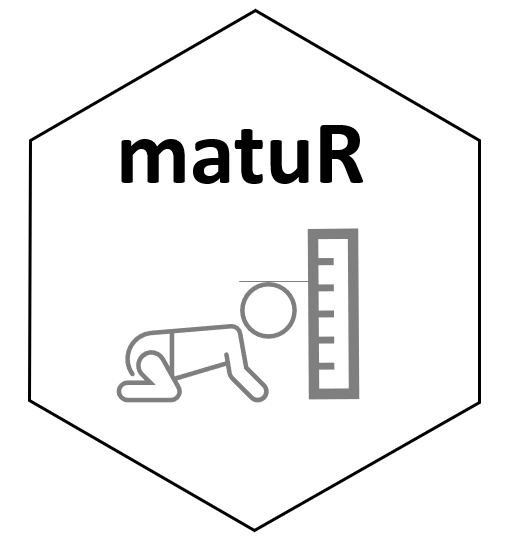

# matuR
Athlete Maturation and Biobanding

**This page is currently Under Development**



# Intro
Accounting for maturation stages in young athletes is paramount for talent identification. The concept of biobanding, or grouping of athletes based on their biological development as opposed to their chronological age, has also been widely researched to enable comparison of physical attributes across young athletes as well as better adjustment of the competition demands athletes are exposed to. 
  
It is beyond the scope of this package to discuss the different methods available for the assessment of maturation in young athletes. The goal of this repository is to present **matuR**, a package that provide a simple framework for professionals working with young athletes to calculate common maturation metrics and quick visual reports to help facilitate interpretation of the results.

The main functions implemented in this package rely heavility on the *Khamis-Roche* method for prediction of adult height, as well as the work from *Mirwald et al,* and *Cumming et al*, to extrapolate maturity offset and maturation stages from raw data. For further details about this methodology, please see the reference section at the bottom of this page.

# Installation

**Install from CRAN**  
```
matuR has not been submitted to CRAN yet. Please use the development version.
```

**Install the development version from GitHub**  
```
install.packages("devtools")
devtools::install_github("josedv82/matuR")
```

### References
The methods behind the calculations implemented as part of the functions in this package rely heavily on the following research:

* Khamis, H. J., & Roche, A. F, 1994. Predicting adult height without using skeletal age: The Khamis-Roche method. Pediatrics, 94, 504–507 [Link](https://pubmed.ncbi.nlm.nih.gov/7936860/)  

* Mirwald, R.L., Baxter-Jones, A.D.G., Bailey, D.A., & Beunen, G.P., 2002. An assessment of maturity from anthropometric measurements. Medicine and Science Sports Exercise, 34,4, pp. 689–694. [Link](https://pubmed.ncbi.nlm.nih.gov/11932580/)

* Sean P. Cumming, Rhodri S. Lloyd, John L. Oliver, Joey C. Eisenmann & Robert M. Malina, 2017. Bio-banding in Sport: Applications to competition, talent identification and strength and conditioning of youth athletes, National Strength and Conditioning Association, vol.39, 2 [Link](https://journals.lww.com/nsca-scj/Abstract/2017/04000/Bio_banding_in_Sport__Applications_to_Competition,.6.aspx)
