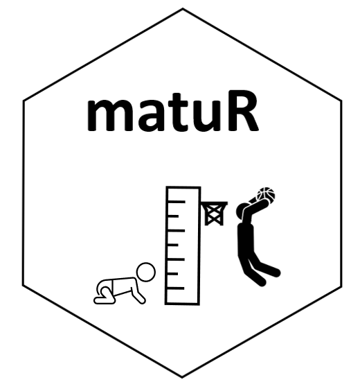

# matuR
Athlete Maturation and Biobanding

**This page is currently Under Development**



# Intro
Accounting for maturation stages in young athletes is paramount for talent identification. The concept of biobanding, or grouping of athletes based on their biological development as opposed to their chronological age, has also been widely researched to enable comparison of physical attributes across young athletes as well as better adjustment of the training and competition demands athletes are exposed to. 
  
The goal of this repository is to showcase **matuR**, a package that provides a simple framework for professionals working with young athletes to calculate and visualize common maturation metrics using not invasive methods. The two methods implemented are:

**Prediction of age at Peak Height Velocity (PHV):** This method is based on research from Mirlwald et al and uses the following parameters:

* gender  
* date of birth  
* date of measurement  
* height (cms)  
* sitting height (cms)  
* weight (kgs)  
  
**Predicted Adult Height (PAH):** This method is based on the Khamis-Roche method and it used the following parameters:  

* age
* gender
* height (cms)  
* weight (kgs)  
* mother height (cms)  
* father height (cms)  
  
For further details about these two methods, their protocols and calculations see the reference section at the bottom of this page.  


# Installation

Install from CRAN**  
```
matuR has not been submitted to CRAN yet. Please use the development version.
```
  
Install the development version from GitHub**  
```
install.packages("devtools")
devtools::install_github("josedv82/matuR")
```

# Data

### User Data

Use this template for data collection. Ensure that all fields have information. **matuR** runs both (age @ PHV and Khamis-Roche) methods together on the same dataset.

[Data Template](https://github.com/josedv82/matuR/blob/master/man/images/template.xlsx)

### Demo Data

**matuR** provides a demo data sample for users to familiarize with the package. 

```
library(matuR)

data_sample
```

# Usage

The main functions within the package are `maturation_cm()` and `maturation_in()`. Both functions perform the same calculations and return the same data. Users can choose one or the other one depending on the units they wish to explore the results. The function takes the raw data from the template and performs the Khamis-Roche and Mirwarld calculations.

```
library(matuR)

maturation_cm(data_sample)

maturation_in(data_sample)

```


# References
The methods behind the calculations implemented as part of the functions in this package rely heavily on the following research:

* Khamis, H. J., & Roche, A. F, 1994. Predicting adult height without using skeletal age: The Khamis-Roche method. Pediatrics, 94, 504–507 [Link](https://pubmed.ncbi.nlm.nih.gov/7936860/)  

* Mirwald, R.L., Baxter-Jones, A.D.G., Bailey, D.A., & Beunen, G.P., 2002. An assessment of maturity from anthropometric measurements. Medicine and Science Sports Exercise, 34,4, pp. 689–694. [Link](https://pubmed.ncbi.nlm.nih.gov/11932580/)

* Sean P. Cumming, Rhodri S. Lloyd, John L. Oliver, Joey C. Eisenmann & Robert M. Malina, 2017. Bio-banding in Sport: Applications to competition, talent identification and strength and conditioning of youth athletes, National Strength and Conditioning Association, vol.39, 2 [Link](https://journals.lww.com/nsca-scj/Abstract/2017/04000/Bio_banding_in_Sport__Applications_to_Competition,.6.aspx)
